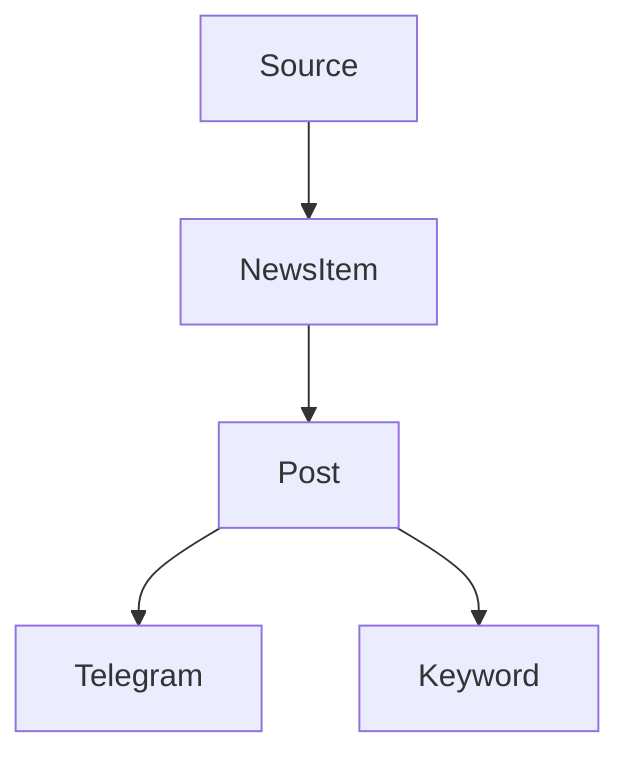

# 🚀 Generator Post for Telegram

> Автоматическая система сбора новостей, генерации постов для Telegram, тематической классификации и управления контентом через API.

[](#)
[](https://fastapi.tiangolo.com/)
[](https://docs.celeryq.dev/)
[](https://redis.io/)
[](https://platform.openai.com/)
[](LICENSE)

### CI / Репозиторий

<!-- GitHub -->

[](https://github.com/your_username/your_repo/actions)
[](https://github.com/your_username/your_repo/issues)
[](https://github.com/your_username/your_repo/stargazers)

<!-- GitLab -->

<!--
[](https://gitlab.com/your_username/your_repo/-/pipelines)
-->

---

## ✨ Особенности проекта

* 🔄 Полный цикл: сбор → генерация → публикация
* ⚡ Асинхронная обработка и масштабирование
* 🤖 Генерация контента через OpenAI
* 🏷 Автоматическая классификация и теги
* 🔌 REST API
* 📊 Health-check
* 🧩 Модульная архитектура

---

## 📌 Содержание

* [Описание](#описание)
* [Быстрый старт](#быстрый-старт)
* [Технологии](#технологии)
* [Структура проекта](#структура-проекта)
* [Установка](#установка)
* [Настройка](#настройка-env)
* [Запуск](#запуск)
* [Как это работает](#как-это-работает)
* [API](#api)
* [Health-check](#health-check)
* [Contributing](#contributing)
* [Roadmap](#roadmap)
* [Автор](#автор)
* [Лицензия](#лицензия)

---

## 📖 Описание

**Generator Post for Telegram** — это асинхронная система автоматического сбора новостей, генерации постов для Telegram и их публикации с использованием AI.

Проект подходит для:

* владельцев Telegram-каналов
* разработчиков контент-ботов
* AI/ML-инженеров
* пет-проектов и стартапов

---

## ⚡ Быстрый старт

```bash
git clone https://github.com/your_username/your_repo.git
cd your_repo
cp .env.example .env
poetry install
docker-compose up -d
uvicorn app.main:app --reload
```

📚 Swagger UI:
👉 [http://127.0.0.1:8000/docs](http://127.0.0.1:8000/docs)

---

## 🧰 Технологии

* Python 3.13+
* FastAPI
* Celery + Redis
* SQLAlchemy + Alembic
* SQLite / PostgreSQL
* OpenAI API
* Telethon

---

## 📂 Структура проекта

<details>
<summary>Показать структуру</summary>

```text
app/
 ├── api/          # REST API
 ├── ai/           # OpenAI интеграция
 ├── tasks/        # Celery задачи
 ├── news_parser/  # Парсеры источников
 ├── utils/        # Утилиты
 ├── models.py     # ORM-модели
 ├── database.py   # Подключение БД
 ├── config.py     # Конфигурация
```

</details>

---

## ⚙️ Установка

### Poetry

```bash
curl -sSL https://install.python-poetry.org | python3 -
poetry install
```

### pip

```bash
pip install -r requirements.txt
```

---

## 🔧 Настройка `.env`

> ⚠️ Никогда не коммитьте `.env` в репозиторий — используйте `.env.example`

```dotenv
DEBUG=True

TELEGRAM_API_ID=your_id
TELEGRAM_API_HASH=your_hash
TELEGRAM_BOT_TOKEN=your_token
TELEGRAM_CHANNEL_ID=@channel

NEWS_KEYWORDS=python,fastapi,ai,ml

REDIS_URL=redis://localhost:6379/0

OPENAI_API_KEY=your_openai_key
```

---

## 🚀 Запуск

### FastAPI

```bash
uvicorn app.main:app --reload
```

### Celery

```bash
run_celery.bat
```

---

## 📊 Как это работает



---

## 🔌 API

### Посты

| Метод  | URL                 | Описание         |
| ------ | ------------------- | ---------------- |
| GET    | /api/posts          | Список постов    |
| POST   | /generate           | Запуск генерации |
| POST   | /posts/{id}/publish | Публикация       |
| DELETE | /api/posts/{id}     | Удаление         |

### Источники

| Метод | URL                       | Описание      |
| ----- | ------------------------- | ------------- |
| GET   | /api/sources              | Все источники |
| PATCH | /api/sources/{id}/enabled | Вкл/выкл      |

---

## ❤️ Health-check

| Метод | Назначение     |
| ----- | -------------- |
| GET   | /health        |
| GET   | /health/celery |

---

## 🤝 Contributing

Контрибьюции приветствуются!

1. Fork репозитория
2. Создай feature-ветку
3. Commit с описанием
4. Открой Pull Request

Подробнее: [CONTRIBUTING.md](CONTRIBUTING.md)

---

## 🗺 Roadmap

* [x] Парсинг новостей
* [x] Генерация постов через AI
* [x] Telegram-публикация
* [ ] Веб-панель
* [ ] Аналитика
* [ ] Мультиканальность
* [ ] Рекомендательная система

---

## 👤 Автор

**MrJonson**
📧 [flashh@list.ru](mailto:flashh@list.ru)

---

## 📄 Лицензия

MIT License — см. файл [LICENSE](LICENSE)

---